# noderator

Developer: Karla Steinbrink ([Karla-Stein](https://www.github.com/Karla-Stein))

## Project Overview

Noderator is an AI-powered workflow generation platform that enables users to create production-ready n8n workflows using natural language. Through a clean Django interface, users simply describe the automation they want to build and an AI-powered backend generates a fully structured n8n workflow before deploying it directly to an n8n instance.

The project combines Django for the user experience with n8n as the automation engine, allowing users to create complex workflow automations without manually configuring nodes or writing workflow JSON.

Rather than acting as another chatbot, Noderator focuses on solving a practical developer problem: reducing the time required to design, build and deploy automation workflows while maintaining valid, production-ready output.

## Project Rationale

Noderator was developed as a practical exploration of how modern AI technologies can be integrated with full-stack web development and workflow automation. The primary objective of the project is not to replace existing automation platforms such as n8n, but to demonstrate how a custom web application can provide an intuitive user experience while leveraging n8n as its automation engine.

The project combines a Django frontend with an n8n backend, allowing users to describe an automation in natural language through a web interface. The application then communicates with n8n to generate a workflow and automatically produces supporting documentation, including setup instructions, required credentials and technical requirements.

Building Noderator provided the opportunity to explore several areas of modern software development, including REST API integration, AI-assisted workflow generation, backend automation, prompt engineering and the interaction between a custom web application and an external automation platform.

Although the current project focuses on workflow generation and documentation, it has been designed with scalability in mind. Future iterations may introduce customisable workflow templates, AI-assisted workflow optimisation and creator storefronts that allow automation developers to package and distribute their workflow solutions.

## UX

### The 5 Planes of UX

## 1. Strategy

**Purpose**

- Demonstrate the integration of a Django web application with n8n as the automation engine.
- Provide an intuitive interface that enables users to generate n8n workflows using natural language.
- Automatically generate supporting documentation alongside each workflow to simplify deployment and configuration.

**Primary User Needs**

- Users need a simple interface where they can describe the automation they want to build using natural language.
- Users need the generated workflow to be created automatically within their connected n8n instance.
- Users need clear documentation explaining how to configure and deploy the generated workflow.

**Business Goals**

- Demonstrate how AI can simplify workflow development.
- Showcase the integration of Django, REST APIs, AI and n8n within a single application.
- Reduce the time required to design and document automation workflows.
- Establish a scalable foundation for future commercial features such as workflow templates, creator storefronts and workflow marketplaces.

## 2. Scope

### Features

**[Features](#features)** (see below)

**Content Requirements**

- Public landing page introducing Noderator and its purpose.
- User authentication (registration, login and logout).
- Natural language workflow generation interface.
- Prompt submission form.
- Connection to a user's n8n instance via API.
- Automatic workflow generation within the connected n8n instance.
- Workflow detail page displaying:
  - Original prompt
  - AI-generated project overview
  - Workflow status(created/failed)
  - Setup instructions
  - Required credentials
  - Technical requirements
  - Link to the generated n8n workflow
- Responsive success and error pages.
- Custom 404 page.

### 3. Structure

**Information Architecture**

- **Navigation Menu**:
  - Links to Home, Dashboard, Generate Workflow, My Workflows, Account and authentication pages.
  - Authenticated users can access their dashboard, submit workflow prompts and view previously generated workflow documentation and links.
  - Users can open generated workflows directly in their connected n8n instance.
  - Superusers have access to administrative functionality for managing users and reviewing generated workflow records.

- **Hierarchy**:
  - Clear landing page explaining Noderator’s purpose.
  - Prominent prompt submission area for generating new workflows.
  - Dashboard overview showing generated workflow name, workflow status and quick access links.
  - Workflow detail pages displaying the original prompt, setup instructions, required credentials, technical requirements and the n8n workflow link.

  **User Flow**

1. Guest user lands on the homepage and reads about Noderator’s purpose and core functionality.
2. Guest user is prompted to create an account or sign in before generating a workflow.
3. Authenticated user accesses the dashboard and selects the option to generate a new workflow.
4. User submits a natural language prompt describing the automation they want to build.
5. Django sends the prompt to the connected n8n workflow builder via API/webhook.
6. n8n generates the workflow and creates it inside the connected n8n instance.
7. Django stores the workflow request, status, documentation and n8n workflow link.
8. User is redirected to a workflow detail page showing the original prompt, setup instructions, required credentials, technical requirements and a button to open the workflow in n8n.
9. User opens the generated workflow in n8n and completes any remaining configuration, such as credentials or API keys.
10. Superusers manage users and review generated workflow records through the Django admin panel.
11. Users attempting to access invalid URLs are redirected to a custom 404 error page.

#### 4. Skeleton

**[Wireframes](#wireframes)** (see below)

#### 5. Surface

**Visual Design Elements**
- **[Colours](#colour-scheme)** (see below)
- **[Typography](#typography)** (see below)

### Colour Scheme

| Colour | Screenshot | Purpose | 
| --- | --- | --- | 
| Void Black | 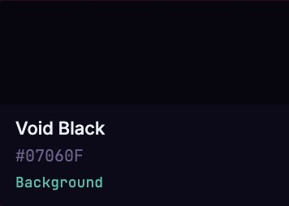 | Primary application background. Used for the main canvas, dashboard and immersive dark interface. Creates contrast and keeps attention on content.| 
| Dark Grape | 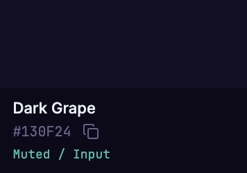 | Elevated surfaces. Separates interface layers while maintaining the dark theme. |
| Purple Dusk | 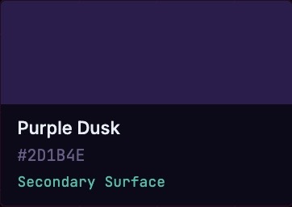 | Secondary surfaces. Adds depth without distracting from primary content. |
| Mauve | 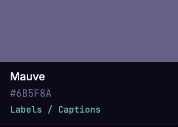 | Secondary text. Used where information should remain visible but not compete with primary content. |
| Ash White |   | Primary text colour for headings, body text, icons and essential interface elements. Ensures maximum readability and accessibility. |
| Hot Pink | 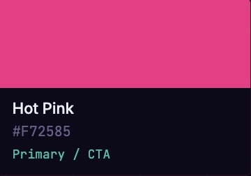 | Primary call-to-action colour. Used for buttons such as Generate Workflow, Publish, Create, and important user actions. |
| Electric Purple| 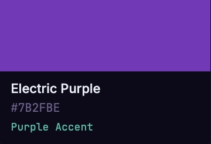  | Accent colour used for links, selected navigation items, active states, badges and highlights. Reinforces the platform’s AI identity. |
| Intelligence Teal | 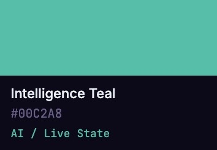  | AI status colour. Used to indicate AI activity, successful generation, processing states, live connections and automation status indicators. Gives users immediate feedback when AI is working. |
| Gradient | 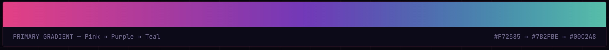  | Hero backgrounds, premium CTA sections. Creates a modern, high-tech aesthetic while drawing attention to key actions.|

### Typography

| Font | Screenshot | Purpose | 
| --- | --- | --- | 
| Bricolage Grotesque | 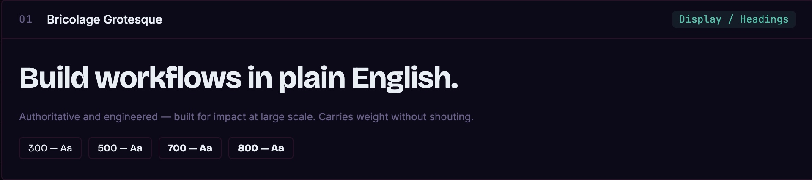  | Brand personality. Primary display typeface used for hero headings, page titles and key marketing content. Its strong geometric character conveys confidence, innovation and technical authority, helping establish Noderator as a professional AI platform.|
| Inter| 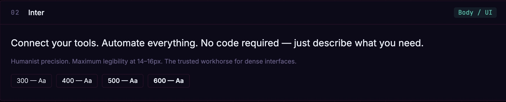  | Usability and readability. Primary interface typeface used for navigation, body text, forms, documentation, buttons and user interface components. Chosen for its exceptional readability at small sizes, ensuring a clean, accessible and user-friendly experience throughout the application.|
| JetBrains Mono | 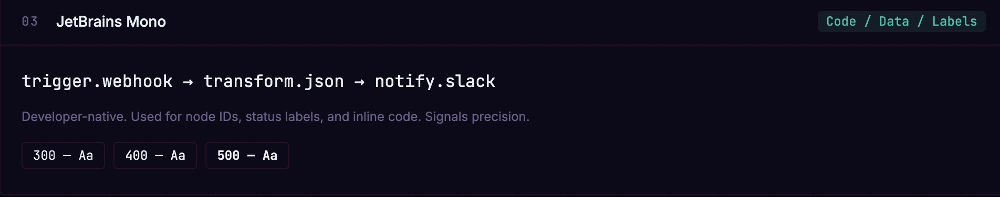  | Technical precision. Monospaced typeface reinforces the platform’s developer-focused identity while clearly distinguishing technical information from standard interface text.|